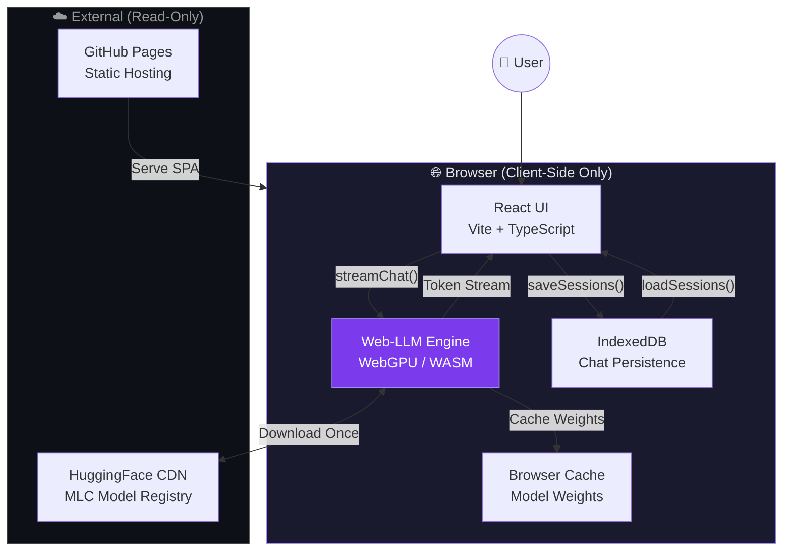
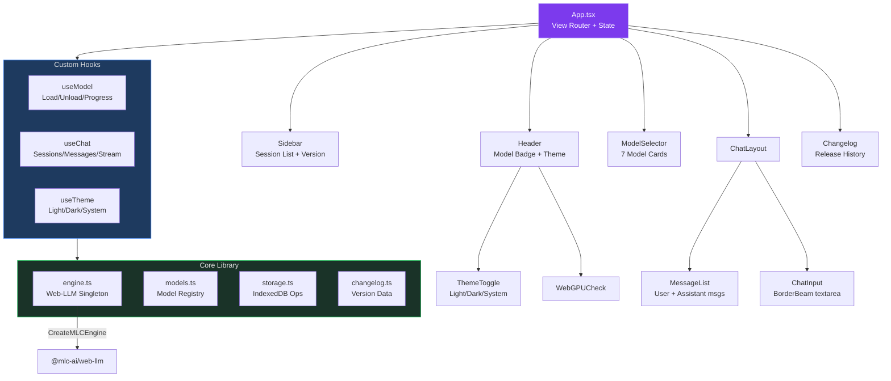
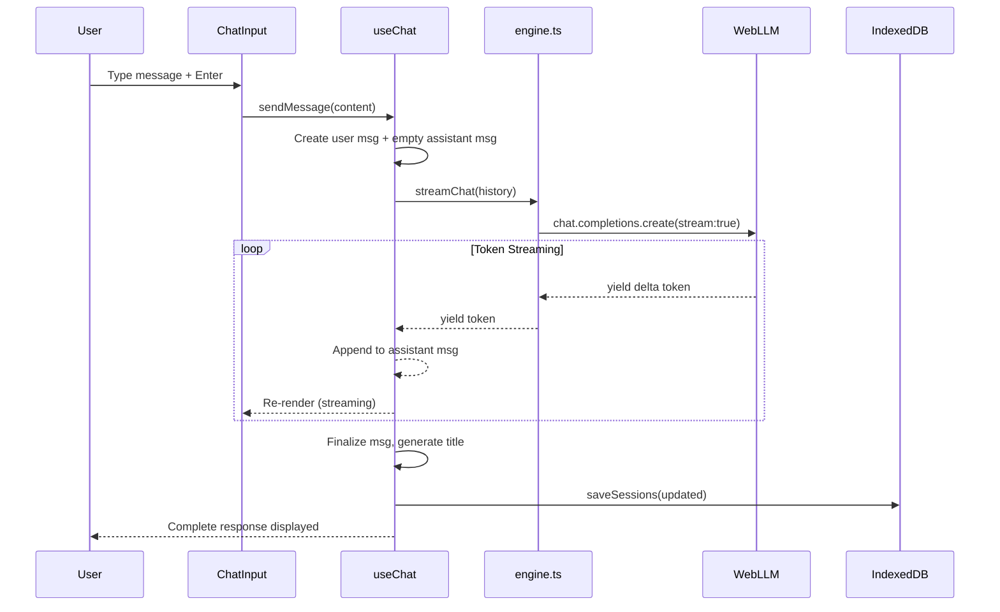
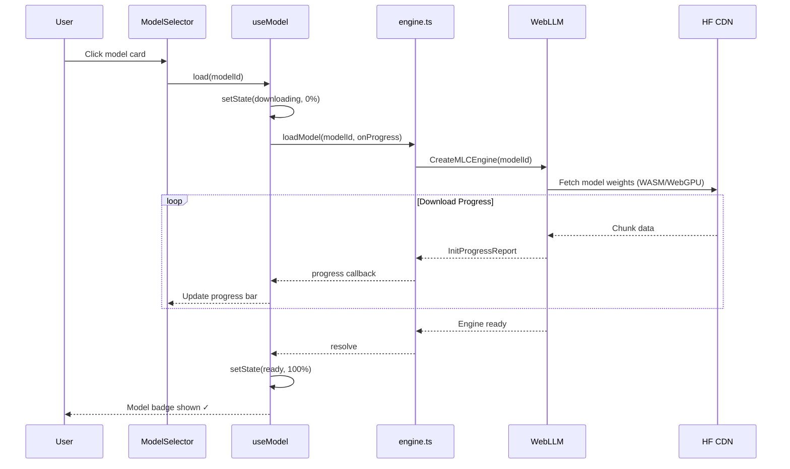

# Monday - Browser AI Chat

> Run open-source AI models **directly in your browser**. No server, no install, 100% private.

[](https://github.com/unbug/monday/actions/workflows/deploy.yml)
[](LICENSE)

**[Live Demo](https://unbug.github.io/monday/)** · **[Changelog](https://unbug.github.io/monday/)**

---

## Features

- **Zero Install** — Pure browser experience, no downloads needed
- **Browser-Native Inference** — Models run locally via WebGPU + WASM using [Web-LLM](https://github.com/mlc-ai/web-llm)
- **7 Pre-configured Models** — Qwen 2.5, SmolLM2, Gemma 2, Phi 3.5, TinyLlama
- **Streaming Output** — Token-by-token real-time response
- **Chat History** — Persistent multi-session conversations via IndexedDB
- **Changelog** — In-app version history with expandable release details
- **BorderBeam UI** — Animated border effects with ocean/colorful/mono variants
- **Theme Toggle** — Light / Dark / System with auto-detection
- **Mobile Responsive** — Sidebar overlay, auto-close, safe-area support
- **PWA Ready** — Web app manifest, apple-touch-icon
- **100% Private** — Nothing leaves your browser

---

## Architecture

### High-Level System Architecture



### Component Architecture



### Data Flow: Chat Message Lifecycle



### Model Loading Flow



---

## Tech Stack

| Layer | Technology |
|-------|-----------|
| **Framework** | Vite 8 + React 19 + TypeScript 6 |
| **AI Runtime** | [@mlc-ai/web-llm](https://github.com/mlc-ai/web-llm) (WebGPU + WASM) |
| **UI Effects** | [border-beam](https://www.npmjs.com/package/border-beam) |
| **Persistence** | IndexedDB (sessions, messages) |
| **Deployment** | GitHub Pages via GitHub Actions |
| **Build** | Vite, ESNext target |

---

## Supported Models

| Model | Parameters | Size | Provider |
|-------|-----------|------|----------|
| **Qwen 2.5 0.5B** ⭐ | 0.5B | ~350 MB | Alibaba |
| Qwen 2.5 1.5B | 1.5B | ~900 MB | Alibaba |
| SmolLM2 360M | 360M | ~200 MB | HuggingFace |
| SmolLM2 1.7B | 1.7B | ~1 GB | HuggingFace |
| Gemma 2 2B | 2B | ~1.3 GB | Google |
| Phi 3.5 Mini | 3.8B | ~2 GB | Microsoft |
| TinyLlama 1.1B | 1.1B | ~600 MB | Community |

---

## Competitive Analysis

Roadmap informed by deep analysis of these leading AI chat platforms:

| Product | Stars | Key Differentiator | Monday Relevance |
|---------|-------|-------------------|-----------------|
| [Open WebUI](https://github.com/open-webui/open-webui) | 132k | Full-featured self-hosted AI platform: RAG, pipelines, MCP, RBAC, voice/video, image gen | Feature-complete reference for chat UX, RAG, tools |
| [NextChat](https://github.com/ChatGPTNextWeb/NextChat) | 88k | Lightweight cross-platform AI client: Vercel deploy, MCP, masks, artifacts, Tauri desktop | Lightweight UX, prompt templates, artifacts rendering |
| [LobeHub](https://github.com/lobehub/lobe-chat) | 75k | Agent-as-unit-of-work platform: 10k+ plugins, agent groups, personal memory, TTS/STT | Agent system, plugin ecosystem, memory architecture |
| [Jan](https://github.com/janhq/jan) | 42k | Offline desktop ChatGPT: local LLMs via llama.cpp, custom assistants, OpenAI-compatible API | Offline-first philosophy, model management, MCP integration |
| [GPT-Runner](https://github.com/nicepkg/gpt-runner) | 379 | AI presets for code: conversations with code files, IDE integration, version-controlled prompts | Preset system, project-scoped AI configuration |

---

## Roadmap

A phased long-term plan derived from competitive analysis. Each phase builds on the previous.

### Phase 1 — Core Chat Enhancement (v0.2.x)
> Bring chat to feature parity with basic ChatGPT UX

- [x] **Markdown rendering** — Render assistant responses with proper Markdown, code blocks, syntax highlighting
- [x] **Code copy button** — One-click copy for code blocks
- [x] **LaTeX support** — Math equation rendering with KaTeX
- [x] **System prompt** — Customizable system prompt per session
- [x] **Generation params** — Temperature, top_p, max_tokens sliders
- [x] **Auto-scroll control** — Pause auto-scroll when user scrolls up
- [x] **Chat export** — Export conversations as Markdown/JSON
- [ ] **Token counter** — Display tokens/sec and total token usage
- [ ] **Message actions** — Copy, regenerate, edit user messages

### Phase 2 — Model Management (v0.3.x)
> Rich model lifecycle and expanded model support

- [ ] **Model cache manager** — View/delete cached models, show disk usage
- [ ] **More models** — Add Llama 3.2 1B/3B, DeepSeek-R1-Distill, Mistral 7B, Stable Code 3B
- [ ] **Model benchmarks** — Auto-run speed benchmark on load, show tokens/sec
- [ ] **Custom model import** — Load custom MLC-compiled models from URL
- [ ] **Model comparison** — Side-by-side generation from two models
- [ ] **Download resume** — Resume interrupted model downloads
- [ ] **Storage quota** — Show browser storage used vs available

### Phase 3 — Prompt Templates & Personas (v0.4.x)
> Inspired by NextChat masks, GPT-Runner presets, LobeHub agents

- [ ] **Prompt templates** — Pre-built conversation starters (coding assistant, translator, tutor, etc.)
- [ ] **Custom personas** — Create/save/share AI personas with system prompts + params
- [ ] **Persona marketplace** — Browse community-shared personas (static JSON registry)
- [ ] **Quick prompts** — Slash commands (`/translate`, `/code`, `/explain`) in chat input
- [ ] **Context injection** — Attach text/code snippets as context before sending

### Phase 4 — Multimodal & Rich Input (v0.5.x)
> Add vision and file capabilities as models support them

- [ ] **Image input** — Paste/upload images for vision models (when WebGPU vision models available)
- [ ] **File upload** — Attach text files as conversation context
- [ ] **Drag & drop** — Drag files directly into chat
- [ ] **Clipboard paste** — Intelligent paste handling (images, code, rich text)
- [ ] **Voice input** — Browser Speech Recognition API for voice-to-text
- [ ] **TTS output** — Read assistant responses aloud via Web Speech API

### Phase 5 — Knowledge & RAG (v0.6.x)
> Local-first retrieval augmented generation, inspired by Open WebUI RAG

- [ ] **Document upload** — Upload PDFs, TXT, MD files
- [ ] **Client-side chunking** — Split documents into chunks in-browser
- [ ] **Browser vector store** — IndexedDB-based vector storage
- [ ] **Embedding model** — Run small embedding model via Web-LLM
- [ ] **Semantic search** — Query uploaded documents before sending to LLM
- [ ] **Citation display** — Show which document chunks were used in response
- [ ] **Knowledge bases** — Organize documents into named collections

### Phase 6 — Tools & Plugins (v0.7.x)
> Function calling and tool use, inspired by LobeHub plugins and Open WebUI tools

- [ ] **Function calling** — Parse model tool-call outputs and execute browser-side functions
- [ ] **Built-in tools** — Calculator, current time, unit converter, JSON formatter
- [ ] **Web search** — Browser-side web search integration (via public APIs)
- [ ] **Code execution** — Sandboxed JavaScript execution in iframe
- [ ] **Artifacts** — Render generated HTML/SVG/Mermaid in preview panel (like NextChat artifacts)
- [ ] **Plugin system** — Load third-party tool plugins from URL (JSON manifest)
- [ ] **MCP client** — Model Context Protocol support for external tool servers

### Phase 7 — Collaboration & Sharing (v0.8.x)
> Social features inspired by LobeHub channels and Open WebUI community

- [ ] **Share conversations** — Generate shareable link (static HTML export)
- [ ] **Import/export** — Full data import/export (sessions, personas, settings)
- [ ] **WebDAV sync** — Sync data across devices via WebDAV (like NextChat)
- [ ] **Shared personas** — Publish personas to community registry
- [ ] **Conversation forking** — Branch a conversation at any message

### Phase 8 — Desktop & PWA (v0.9.x)
> Expand beyond browser tab, inspired by Jan desktop and NextChat Tauri

- [ ] **Full PWA** — Offline-capable progressive web app with service worker
- [ ] **Install prompt** — Smart install banner for mobile and desktop
- [ ] **Notifications** — Background generation completion notifications
- [ ] **Desktop app** — Tauri wrapper for native macOS/Windows/Linux
- [ ] **Keyboard shortcuts** — Full keyboard navigation (Cmd+K, Cmd+N, etc.)
- [ ] **Multi-window** — Open conversations in separate windows/tabs

### Phase 9 — Advanced AI Features (v1.0.x)
> Towards a complete local AI workstation

- [ ] **Multi-turn memory** — Compress long conversations for extended context
- [ ] **Agent mode** — Multi-step task execution with tool use
- [ ] **Model chaining** — Pipeline: fast model drafts → large model refines
- [ ] **Batch generation** — Generate multiple responses and pick best
- [ ] **A/B testing** — Compare model outputs with user ratings
- [ ] **Usage analytics** — Local analytics dashboard (model usage, tokens, sessions)
- [ ] **i18n** — Multi-language interface (English, 中文, 日本語, etc.)
- [ ] **Accessibility** — Screen reader support, keyboard navigation, high contrast

---

## Development

```bash
npm install          # Install dependencies
npm run dev          # Start dev server (http://localhost:5173)
npm run build        # Production build to dist/
npm run preview      # Preview production build
```

## Requirements

- Chrome 113+ or Edge 113+ (WebGPU support required)
- GPU with 2GB+ VRAM recommended
- ~200MB–2GB storage per model (cached in browser)

## Project Structure

```
monday/
├── public/
│   ├── favicon.svg            # App icon (purple gradient smiley)
│   ├── apple-touch-icon.svg   # iOS home screen icon
│   └── manifest.json          # PWA manifest
├── src/
│   ├── App.tsx                # Root: view router, state orchestration
│   ├── App.css                # All component styles
│   ├── components/
│   │   ├── Sidebar.tsx        # Session list, brand, version link
│   │   ├── ModelSelector.tsx  # Model cards with BorderBeam
│   │   ├── MessageList.tsx    # Chat message rendering
│   │   ├── ChatInput.tsx      # Input textarea with send/stop
│   │   ├── Changelog.tsx      # Expandable release history
│   │   ├── ThemeToggle.tsx    # Light/Dark/System switcher
│   │   └── WebGPUCheck.tsx    # WebGPU compatibility warning
│   ├── hooks/
│   │   ├── useChat.ts         # Session/message/streaming state
│   │   ├── useModel.ts        # Model load/unload/progress
│   │   └── useTheme.ts        # Theme persistence + system detection
│   ├── lib/
│   │   ├── engine.ts          # Web-LLM singleton, streamChat()
│   │   ├── models.ts          # Model registry (7 models)
│   │   ├── storage.ts         # IndexedDB CRUD
│   │   └── changelog.ts       # Version history data
│   └── types/
│       └── index.ts           # TypeScript interfaces
├── index.html                 # Entry HTML with mobile meta tags
├── vite.config.ts             # Vite config (base: '/monday/')
└── package.json               # v0.1.0
```

## License

MIT
