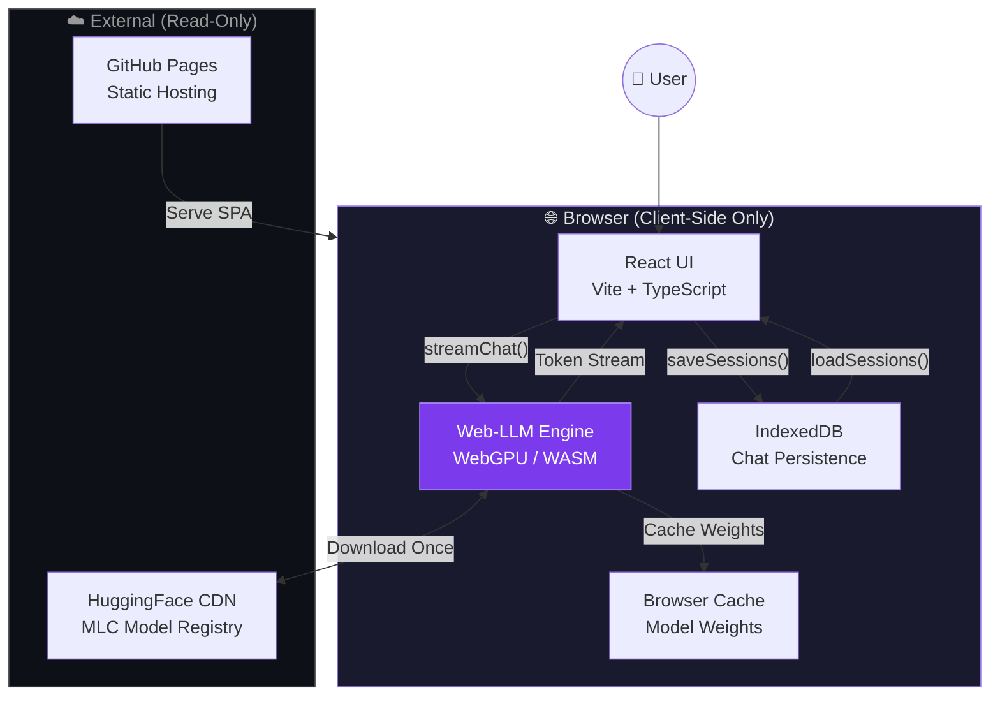
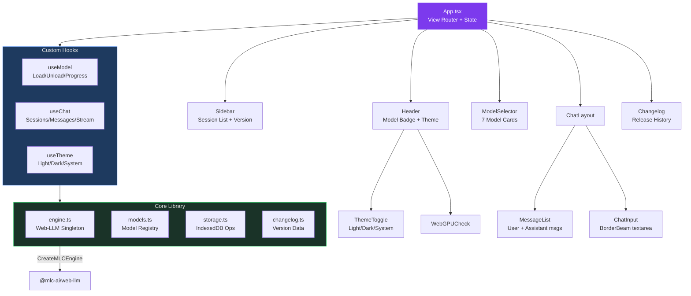
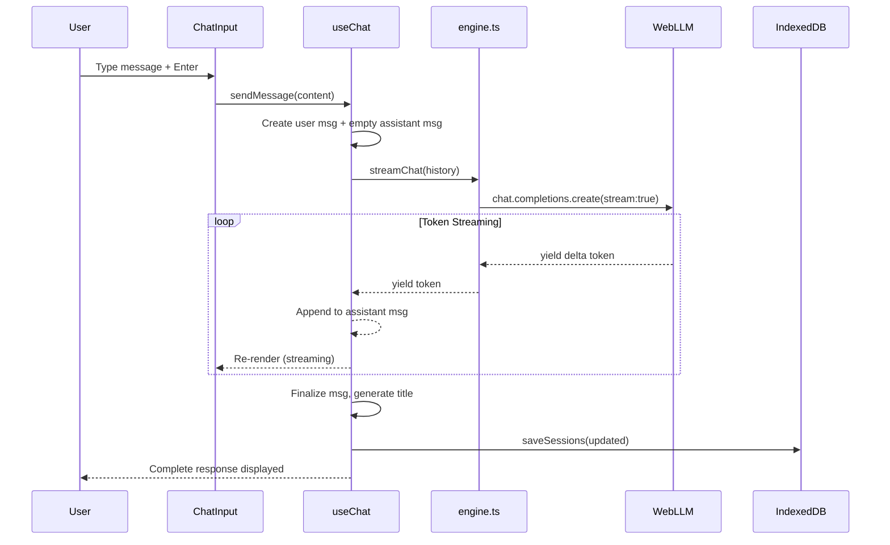
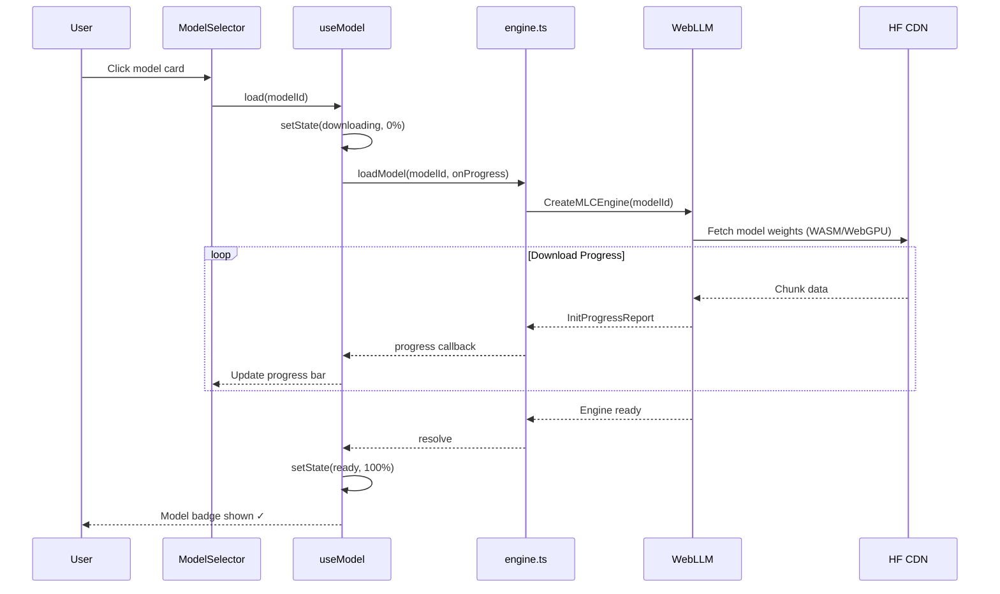

# Monday - Browser AI Chat

> Run open-source AI models **directly in your browser**. No server, no install, 100% private.

[](https://github.com/unbug/monday/actions/workflows/deploy.yml)
[](LICENSE)

**[Live Demo](https://unbug.github.io/monday/)** · **[Changelog](https://unbug.github.io/monday/)**

---

## Features

- **Zero Install** — Pure browser experience, no downloads needed
- **Browser-Native Inference** — Models run locally via WebGPU + WASM using [Web-LLM](https://github.com/mlc-ai/web-llm)
- **23 Pre-configured Models** — Qwen 2.5/3/3.5, SmolLM2, Gemma 2/3, Phi 3.5/4, Llama 3.2, DeepSeek R1, and more
- **Streaming Output** — Token-by-token real-time response
- **Chat History** — Persistent multi-session conversations via IndexedDB
- **Changelog** — In-app version history with expandable release details
- **Usage Statistics** — Dashboard with daily charts, per-model breakdown, and provider analytics
- **Model Comparison** — Side-by-side generation from two models with real-time token stats
- **Model Benchmark** — Built-in benchmark tool to measure tokens/sec and latency
- **Custom Model Import** — Load custom MLC-compiled models from any HuggingFace URL
- **Download Resume** — Resume interrupted model downloads from where you left off
- **Session Search** — Search conversations by title with date filtering
- **Command Palette** — Quick navigation with ⌘K
- **Prompt Templates & Personas** — 8 built-in personas + custom persona creation
- **Message Actions** — Edit and regenerate user messages inline
- **Generation Parameters** — Per-session temperature, top-p, max tokens sliders
- **System Prompts** — Customizable per-session system prompts
- **Token Counter** — Real-time tokens/sec and total token usage
- **Model Cache Manager** — View and delete cached models
- **Recent Models** — Quick access to recently used models
- **Recommended Models** — Top models based on your usage history
- **Storage Quota** — Monitor browser storage usage
- **Markdown Rendering** — Code highlighting, LaTeX math, GFM tables
- **Chat Export** — Export conversations as Markdown
- **BorderBeam UI** — Animated border effects with ocean/colorful/mono variants
- **Theme Toggle** — Light / Dark / System with auto-detection
- **Mobile Responsive** — Sidebar overlay, auto-close, safe-area support
- **PWA Ready** — Web app manifest, apple-touch-icon
- **100% Private** — Nothing leaves your browser

---

## Architecture

### High-Level System Architecture



### Component Architecture



### Data Flow: Chat Message Lifecycle



### Model Loading Flow



---

## Tech Stack

| Layer | Technology |
|-------|-----------|
| **Framework** | Vite 8 + React 19 + TypeScript 6 |
| **AI Runtime** | [@mlc-ai/web-llm](https://github.com/mlc-ai/web-llm) (WebGPU + WASM) |
| **UI Effects** | [border-beam](https://www.npmjs.com/package/border-beam) |
| **Persistence** | IndexedDB (sessions, messages) |
| **Deployment** | GitHub Pages via GitHub Actions |
| **Build** | Vite, ESNext target |

---

## Supported Models

| Model | Parameters | Size | Provider |
|-------|-----------|------|----------|
| **Qwen 3 0.6B** ⭐ | 0.6B | ~400 MB | Alibaba |
| Qwen 3 1.7B | 1.7B | ~1 GB | Alibaba |
| Qwen 3 4B | 4B | ~2.5 GB | Alibaba |
| **Qwen 3.5 0.8B** ⭐ | 0.8B | ~500 MB | Alibaba |
| Qwen 3.5 2B | 2B | ~1.2 GB | Alibaba |
| **Qwen 2.5 0.5B** ⭐ | 0.5B | ~350 MB | Alibaba |
| Qwen 2.5 1.5B | 1.5B | ~900 MB | Alibaba |
| Qwen 2.5 3B | 3B | ~1.8 GB | Alibaba |
| Qwen 2.5 Coder 1.5B | 1.5B | ~900 MB | Alibaba |
| **SmolLM2 360M** | 360M | ~200 MB | HuggingFace |
| SmolLM2 1.7B | 1.7B | ~1 GB | HuggingFace |
| **Gemma 2 2B** | 2B | ~1.3 GB | Google |
| **Gemma 3 4B** | 4B | ~2.5 GB | Google |
| Gemma 3 1B | 1B | ~700 MB | Google |
| **Phi 3.5 Mini** | 3.8B | ~2 GB | Microsoft |
| **Phi 4 Mini** ⭐ | 3.8B | ~2.2 GB | Microsoft |
| **DeepSeek R1 Distill Qwen 1.5B** ⭐ | 1.5B | ~1 GB | DeepSeek |
| **Llama 3.2 1B** | 1B | ~700 MB | Meta |
| **Llama 3.2 3B** | 3B | ~1.8 GB | Meta |
| TinyLlama 1.1B | 1.1B | ~600 MB | Community |
| StableLM 2 Zephyr 1.6B | 1.6B | ~950 MB | Stability AI |
| InternLM 2.5 1.8B | 1.8B | ~1.1 GB | Shanghai AI Lab |
| OLMo 1B | 1B | ~600 MB | Allen Institute |

⭐ = Recommended for most users

---

## Competitive Analysis

Roadmap informed by deep analysis of these leading AI chat platforms:

| Product | Stars | Key Differentiator | Monday Relevance |
|---------|-------|-------------------|-----------------|
| [Open WebUI](https://github.com/open-webui/open-webui) | 132k | Full-featured self-hosted AI platform: RAG, pipelines, MCP, RBAC, voice/video, image gen | Feature-complete reference for chat UX, RAG, tools |
| [NextChat](https://github.com/ChatGPTNextWeb/NextChat) | 88k | Lightweight cross-platform AI client: Vercel deploy, MCP, masks, artifacts, Tauri desktop | Lightweight UX, prompt templates, artifacts rendering |
| [LobeHub](https://github.com/lobehub/lobe-chat) | 75k | Agent-as-unit-of-work platform: 10k+ plugins, agent groups, personal memory, TTS/STT | Agent system, plugin ecosystem, memory architecture |
| [Jan](https://github.com/janhq/jan) | 42k | Offline desktop ChatGPT: local LLMs via llama.cpp, custom assistants, OpenAI-compatible API | Offline-first philosophy, model management, MCP integration |
| [GPT-Runner](https://github.com/nicepkg/gpt-runner) | 379 | AI presets for code: conversations with code files, IDE integration, version-controlled prompts | Preset system, project-scoped AI configuration |

---

## Roadmap

> **North Star (immutable)**: _A local-first, browser-native AI workstation._
> WebGPU inference + optional remote providers, with first-class memory,
> tools and offline capability — all running entirely in the user's browser.
>
> **Three non-negotiable axes** every release must satisfy:
>
> 1. **Local-first** — every feature works with WebGPU + IndexedDB only;
>    cloud providers are an option, never a requirement.
> 2. **Phase progression** — releases ship the **earliest unreleased
>    version** in `### Versioned task breakdown` end-to-end. No skipping
>    versions, no scope outside the listed checkboxes.
> 3. **Release gate** — a version is "done" only when its release gate is
>    green. Trivial built-ins or polish do **not** unlock the next version.

### Versioned task breakdown

The autonomous Cron picks the **first unchecked, unblocked** item in the
**earliest unreleased version** and ships it end-to-end (code + build green
+ visible in UI + entry in CHANGELOG). It never invents scope outside this
list, and never skips a version. Past versions remain documented as a
historical record below.

#### v0.25 — Knowledge & RAG (storage layer) _(current target)_

Phase 5 of the legacy plan, split for scope safety. RAG is the highest-value
unmet feature in the product.

- [x] **Document upload** — Upload PDFs / TXT / MD files into a "Knowledge"
      panel (PDF parsing via `pdfjs-dist`)
- [x] **Client-side chunking** — Split documents into ~500-token chunks
      in-browser (no server)
- [x] **Browser vector store** — IndexedDB-backed vector store with
      cosine similarity, schema migration registered in `storage.ts`
- [x] **Knowledge bases** — Organize documents into named collections;
      attach a collection to a session

**Release gate**: a user uploads a 5-page PDF, sees chunks indexed, and a
search box returns the top-K matching chunks (no LLM yet — that's v0.26).

Released: 2026-04-25

#### v0.26 — RAG (retrieval + citation)

- [x] **Embedding model** — Run a small embedding model via Web-LLM
      (e.g. `gte-small` MLC build) and persist embeddings
- [x] **Semantic search** — On send, query the active knowledge base and
      inject top-K chunks into the system prompt
- [x] **Citation display** — Show which chunks were used per assistant
      message, with click-to-open
- [x] **Citation persistence** — Citations survive page reload (stored
      alongside message in IndexedDB)

**Release gate**: a question answered using a chunk shows a citation that
opens to the exact span of the source document; reload preserves it.

Released: 2026-04-26

#### v0.27 — Tools, Function calling, MCP

Phase 6 advanced — the **only** sanctioned tools work. Net-new built-in
mini-tools (calculator / clock / unit converter / JSON formatter / one-shot
web-search button / standalone formatter) are **out of scope**: they
distract from the function-calling / plugin / MCP work that actually
lets users plug in *any* tool. Mini-tools, if at all, ship later **as
plugins** through the system below.

- [x] **Function calling** — Parse model tool-call outputs (OpenAI-style
      `tool_calls` JSON) and dispatch to in-browser functions
- [x] **Plugin system** — Load third-party tool plugins from URL
      (JSON manifest declaring `name / description / inputSchema /
      handlerUrl`)
- [x] **MCP client** — Connect to an MCP server (WebSocket transport) and
      expose its tools to the model
- [x] **Tool call inspector** — A panel that shows the request / response
      / latency of every tool call in a session

**Release gate**: a user installs one external plugin from URL or connects
to one MCP server, the model invokes a tool from it, and the inspector
shows the full request / response.

Released: 2026-04-26

#### v0.28 — Collaboration & Sharing

- [x] **Share conversations** — Generate a shareable static HTML export
      (no server)
- [x] **Import/export** — Full data import / export (sessions, personas,
      settings, knowledge bases) as a single `.monday` zip
- [ ] **WebDAV sync** — Cross-device sync via user-supplied WebDAV server
- [ ] **Shared personas** — Publish a persona to a static community
      registry (curated JSON file in the repo)
- [ ] **Conversation forking** — Branch a session at any message;
      branches are siblings, navigable in the sidebar

**Release gate**: round-trip import → export → re-import preserves every
session, persona and knowledge base byte-for-byte.

Released: 2026-04-26

#### v0.29 — Desktop, PWA polish & shortcuts

- [ ] **Update prompt** — Banner when a new service worker is installed
- [ ] **Offline indicator** — Header chip when offline; gracefully
      disable cloud-only features
- [ ] **Background notifications** — Notify when a long generation
      completes while the tab is hidden (uses existing
      `useNotifications`)
- [ ] **Desktop app** — Tauri wrapper that targets macOS / Windows / Linux
- [ ] **Keyboard shortcuts overlay** — `?` opens a list of every shortcut
      (Cmd+K / Cmd+N / Cmd+⇧S / Cmd+E …); shortcuts also documented in
      the README
- [ ] **Multi-window** — Open a conversation in a separate browser
      window / Tauri window with shared IndexedDB

**Release gate**: a Tauri build runs on macOS with full chat + RAG +
tools functionality; offline mode degrades gracefully.

#### v0.30 — Agent mode & analytics

- [ ] **Multi-turn memory** — Auto-summarize early turns when the context
      window is exceeded; summaries are visible and editable
- [ ] **Agent mode** — Multi-step task execution with tool use (an outer
      planner loop on top of v0.27 function calling)
- [ ] **Model chaining** — Pipeline: fast model drafts → large model
      refines, configurable per persona
- [ ] **Batch generation** — Generate N responses in parallel and pick
      the best
- [ ] **Usage analytics** — Local-only dashboard: model usage, tokens
      consumed, average tps, sessions per day
- [ ] **i18n** — Multi-language interface (English, 中文, 日本語) with
      language picker in settings
- [ ] **Accessibility** — Screen-reader landmarks, keyboard-only
      navigation, high-contrast theme

**Release gate**: a documented agent-mode demo solves a 3-step task
(search → summarize → save) end-to-end with zero manual intervention.

#### v0.31 — Code Arena / Showdown Mode

A richer evolution of the existing **Model Comparison** view, inspired by
[WebDev Arena](https://web.lmarena.ai), [Design Arena](https://designarena.ai)
and the indie "Grass Field challenge" rigs that show up in Twitter dual-pane
screenshots: same prompt → two models → live HTML/canvas preview → shareable
recording. Net-new vs. v0.2's plain text-only comparison.

- [ ] **Dual artifact panes** — Side-by-side terminal-style cards with
      provider badge, model name, status (`pending / streaming / done`)
      and generation duration in seconds
- [ ] **Sandboxed iframe preview** — Each pane mounts the streamed
      HTML/CSS/JS into a `sandbox="allow-scripts"` iframe, refreshed on
      every chunk (debounced) and on a manual **↻ Run** button
- [ ] **Code ↔ Preview tabs** — Per-pane toggle between rendered preview
      and source view, with a **Copy** button on each
- [ ] **Synchronized scroll** — Code view in both panes scrolls in
      lockstep (line-aligned) to make diffs obvious
- [ ] **Challenge prompt library** — Curated presets (Grass Field, Solar
      System, Pelican on a Bicycle, Tetris, Snake, Bouncing Balls,
      Particle System, CSS Loader Gallery), one-click load into the arena
- [ ] **Recording & video export** — `MediaRecorder` captures both
      iframes as a synchronized timelapse `.webm` (default 30 fps,
      configurable), with a small "@username" watermark from settings
- [ ] **PNG share card** — Export a single PNG with both final previews,
      model names, durations and watermark — sized for Twitter (16:9)
- [ ] **Verdict & local leaderboard** — `Team A / Tie / Team B` voting UI;
      results persisted in IndexedDB and aggregated into a per-model
      win/tie/loss table (purely local, no upload)

**Release gate**: a user picks two models, loads the "Grass Field"
preset, hits Send, sees both iframes animate side-by-side, exports a
`.webm` with watermark, votes a winner, and the leaderboard updates.

#### v1.0 — External LLM Providers & Web Search _(stable)_

The "1.0" promise: anything saved in v1.0 keeps working until v2.0.

- [ ] **OpenAI-compatible API** — Configure any OpenAI-compatible endpoint
      (custom base URL + API key, stored encrypted in IndexedDB)
- [ ] **Ollama integration** — Connect to a local Ollama server
      (`http://localhost:11434`) with model auto-discovery
- [ ] **LM Studio** — Connect to LM Studio's local OpenAI-compatible
      server
- [ ] **llama.cpp server** — Connect to `llama.cpp --server` HTTP mode
- [ ] **vLLM** — Connect to a vLLM inference endpoint
- [ ] **DeepSeek API** — First-class DeepSeek cloud provider (chat +
      reasoner models)
- [ ] **Provider switcher** — Per-session toggle between WebGPU local
      inference and external API providers
- [ ] **SearXNG integration** — Web search via a user-supplied SearXNG URL
- [ ] **Stable storage schema v1** — Migration registry frozen; future
      migrations must add, not break, fields

**Release gate**: a 24-hour soak test (1 hour with each provider) passes;
the storage migration test from v0.25 → v1.0 round-trips without loss.

### Cross-cutting standing rules

These apply to **every** version and are enforced by the cron:

1. **No "miscellaneous mini-tool" releases.** A built-in tool that takes
   <1 day to implement (calculator, clock, formatter, converter,
   one-shot web-search button) does **not** count as a version and
   **must not** be added directly. Such utilities ship later as
   first-class plugins via the v0.27 plugin / MCP system, not as
   bespoke React components.
2. **HEARTBEAT.md cites the current target version + the exact
   checkbox(es) in flight.** The Next Steps list is taken verbatim from
   this file, not invented.
3. **Local-first invariant** — every new feature must work with the
   default WebGPU + IndexedDB stack; remote providers are additive.
4. **Storage schema is versioned** — any IndexedDB schema change ships
   with a forward migration in `src/lib/storage.ts`.
5. **No skipping versions** — if v0.25 is unfinished, work on v0.25 only.
   If every checkbox in the current version is blocked, the cron must
   spend the slot on tests, docs, refactors or accessibility for that
   version, **not** on a later version or on net-new mini-tools.

### Historical phases (for reference)

Phases 1–3, Phase 0.8 and parts of Phases 4 / 6 shipped in v0.2 → v0.21.
They remain documented below as a record but are **not authoritative**
for future work — the `### Versioned task breakdown` above is.

> Note: v0.22–v0.24 (Calculator / Web Search / Unit Converter / JSON
> Formatter / Current Time) were rolled back on 2026-04-25 because they
> bypassed this Roadmap. Those features will return only as plugins via
> v0.27.

#### Phase 1 — Core Chat Enhancement (v0.2.x)
> Bring chat to feature parity with basic ChatGPT UX

- [x] **Markdown rendering** — Render assistant responses with proper Markdown, code blocks, syntax highlighting
- [x] **Code copy button** — One-click copy for code blocks
- [x] **LaTeX support** — Math equation rendering with KaTeX
- [x] **System prompt** — Customizable system prompt per session
- [x] **Generation params** — Temperature, top_p, max_tokens sliders
- [x] **Auto-scroll control** — Pause auto-scroll when user scrolls up
- [x] **Chat export** — Export conversations as Markdown/JSON
- [x] **Token counter** — Display tokens/sec and total token usage
- [x] **Message actions** — Copy, regenerate, edit user messages

### Phase 2 — Model Management (v0.3.x)
> Rich model lifecycle and expanded model support

- [x] **Model cache manager** — View/delete cached models, show disk usage
- [x] **More models** — Add Llama 3.2 1B/3B, DeepSeek-R1-Distill, Mistral 7B, Stable Code 3B
- [x] **Model benchmarks** — Auto-run speed benchmark on load, show tokens/sec
- [x] **Custom model import** — Load custom MLC-compiled models from URL
- [x] **Model comparison** — Side-by-side generation from two models
- [x] **Download resume** — Resume interrupted model downloads with progress persistence
- [x] **Storage quota** — Show browser storage used vs available

### Phase 3 — Prompt Templates & Personas (v0.7.x)
> Inspired by NextChat masks, GPT-Runner presets, LobeHub agents

- [x] **Prompt templates** — Pre-built conversation starters (coding assistant, translator, tutor, etc.)
- [x] **Custom personas** — Create/save/share AI personas with system prompts + params
- [ ] **Persona marketplace** — Browse community-shared personas (static JSON registry)
- [x] **Quick prompts** — Slash commands (`/translate`, `/code`, `/explain`) in chat input
- [ ] **Context injection** — Attach text/code snippets as context before sending

### Phase 4 — Multimodal & Rich Input (v0.5.x)
> Add vision and file capabilities as models support them

- [ ] **Image input** — Paste/upload images for vision models (when WebGPU vision models available)
- [ ] **File upload** — Attach text files as conversation context
- [ ] **Drag & drop** — Drag files directly into chat
- [ ] **Clipboard paste** — Intelligent paste handling (images, code, rich text)
- [ ] **Voice input** — Browser Speech Recognition API for voice-to-text
- [ ] **TTS output** — Read assistant responses aloud via Web Speech API

### Phase 5 — Knowledge & RAG (v0.6.x)
> Local-first retrieval augmented generation, inspired by Open WebUI RAG

- [ ] **Document upload** — Upload PDFs, TXT, MD files
- [ ] **Client-side chunking** — Split documents into chunks in-browser
- [ ] **Browser vector store** — IndexedDB-based vector storage
- [ ] **Embedding model** — Run small embedding model via Web-LLM
- [ ] **Semantic search** — Query uploaded documents before sending to LLM
- [ ] **Citation display** — Show which document chunks were used in response
- [ ] **Knowledge bases** — Organize documents into named collections

### Phase 6 — Tools & Plugins (v0.7.x)
> Function calling and tool use, inspired by LobeHub plugins and Open WebUI tools

- [ ] **Function calling** — Parse model tool-call outputs and execute browser-side functions
- [ ] **Built-in tools** — Calculator, current time, unit converter, JSON formatter
- [ ] **Web search** — Browser-side web search integration (via public APIs)
- [ ] **Code execution** — Sandboxed JavaScript execution in iframe
- [ ] **Artifacts** — Render generated HTML/SVG/Mermaid in preview panel (like NextChat artifacts)
- [ ] **Plugin system** — Load third-party tool plugins from URL (JSON manifest)
- [ ] **MCP client** — Model Context Protocol support for external tool servers

### Phase 0.8 — Personalization & Discovery (v0.8.x)
> Personalized experience and easier conversation discovery

- [x] **Model usage tracking** — Automatically track which models you use most
- [x] **Recommended models** — Top 3 most-used models displayed in Model Selector
- [x] **Reset recommendations** — Clear usage history to reset model recommendations
- [x] **Session search** — Search conversations by title in the sidebar
- [x] **Date filtering** — Filter sessions by Today, Yesterday, This Week, This Month
- [ ] **Model usage stats** — Visual chart of model usage frequency
- [x] **Recent models** — Quick access to recently used models

### Phase 7 — Collaboration & Sharing (v0.9.x)
> Social features inspired by LobeHub channels and Open WebUI community

- [ ] **Share conversations** — Generate shareable link (static HTML export)
- [ ] **Import/export** — Full data import/export (sessions, personas, settings)
- [ ] **WebDAV sync** — Sync data across devices via WebDAV (like NextChat)
- [ ] **Shared personas** — Publish personas to community registry
- [ ] **Conversation forking** — Branch a conversation at any message

### Phase 8 — Desktop & PWA (v0.9.x)
> Expand beyond browser tab, inspired by Jan desktop and NextChat Tauri

- [ ] **Full PWA** — Offline-capable progressive web app with service worker
- [ ] **Install prompt** — Smart install banner for mobile and desktop
- [ ] **Notifications** — Background generation completion notifications
- [ ] **Desktop app** — Tauri wrapper for native macOS/Windows/Linux
- [ ] **Keyboard shortcuts** — Full keyboard navigation (Cmd+K, Cmd+N, etc.)
- [ ] **Multi-window** — Open conversations in separate windows/tabs

### Phase 9 — Advanced AI Features (v1.0.x)
> Towards a complete local AI workstation

- [ ] **Multi-turn memory** — Compress long conversations for extended context
- [ ] **Agent mode** — Multi-step task execution with tool use
- [ ] **Model chaining** — Pipeline: fast model drafts → large model refines
- [ ] **Batch generation** — Generate multiple responses and pick best
- [ ] **A/B testing** — Compare model outputs with user ratings
- [ ] **Usage analytics** — Local analytics dashboard (model usage, tokens, sessions)
- [ ] **i18n** — Multi-language interface (English, 中文, 日本語, etc.)
- [ ] **Accessibility** — Screen reader support, keyboard navigation, high contrast

### Phase 10 — External LLM Providers & Web Search (v1.1.x)
> Connect to cloud and local AI servers alongside native WebGPU inference

- [ ] **OpenAI-compatible API** — Configure any OpenAI-compatible endpoint (custom base URL + API key)
- [ ] **Ollama integration** — Connect to a local Ollama server (http://localhost:11434)
- [ ] **LM Studio** — Connect to LM Studio's built-in OpenAI-compatible local server
- [ ] **llama.cpp server** — Connect to llama.cpp's HTTP server (`--server` mode)
- [ ] **vLLM** — Connect to a vLLM inference server endpoint
- [ ] **DeepSeek API** — First-class DeepSeek cloud API provider (chat + reasoner models)
- [ ] **Provider switcher** — Toggle between WebGPU local inference and external API providers in-session
- [ ] **SearXNG integration** — Web search via a self-hosted SearXNG instance URL
- [ ] **Web search tool** — Inject search results as context before sending to the model

---

## Development

```bash
npm install          # Install dependencies
npm run dev          # Start dev server (http://localhost:5173)
npm run build        # Production build to dist/
npm run preview      # Preview production build
```

## Requirements

- Chrome 113+ or Edge 113+ (WebGPU support required)
- GPU with 2GB+ VRAM recommended
- ~200MB–2GB storage per model (cached in browser)

## Project Structure

```
monday/
├── public/
│   ├── favicon.svg            # App icon (purple gradient smiley)
│   ├── apple-touch-icon.svg   # iOS home screen icon
│   └── manifest.json          # PWA manifest
├── src/
│   ├── App.tsx                # Root: view router, state orchestration
│   ├── App.css                # All component styles
│   ├── components/
│   │   ├── Sidebar.tsx        # Session list, brand, version link
│   │   ├── ModelSelector.tsx  # Model cards with BorderBeam
│   │   ├── MessageList.tsx    # Chat message rendering
│   │   ├── ChatInput.tsx      # Input textarea with send/stop
│   │   ├── Changelog.tsx      # Expandable release history
│   │   ├── ThemeToggle.tsx    # Light/Dark/System switcher
│   │   └── WebGPUCheck.tsx    # WebGPU compatibility warning
│   ├── hooks/
│   │   ├── useChat.ts         # Session/message/streaming state
│   │   ├── useModel.ts        # Model load/unload/progress
│   │   └── useTheme.ts        # Theme persistence + system detection
│   ├── lib/
│   │   ├── engine.ts          # Web-LLM singleton, streamChat()
│   │   ├── models.ts          # Model registry (7 models)
│   │   ├── storage.ts         # IndexedDB CRUD
│   │   └── changelog.ts       # Version history data
│   └── types/
│       └── index.ts           # TypeScript interfaces
├── index.html                 # Entry HTML with mobile meta tags
├── vite.config.ts             # Vite config (base: '/monday/')
└── package.json               # v0.1.0
```

## License

MIT
